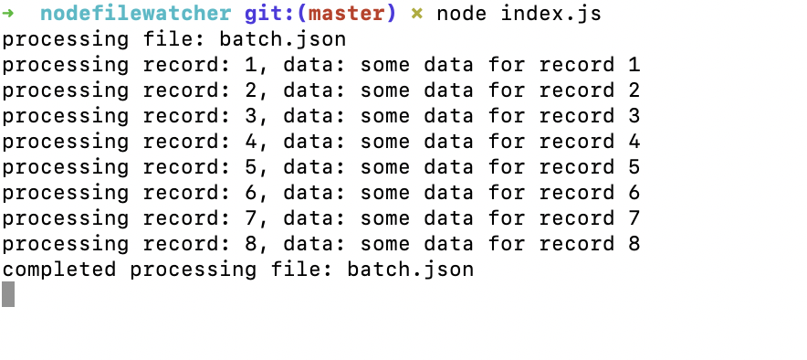

# Filewatcher POC
pull the code down.
open a terminal and run the program "node index.js"
open a second terminal, go into the done directory and move the batch file from the done to the watch directory. "mv batch.json ../watch/batch.json"
Results:
1. file will be moved from watch to done folders
2. see restults in the 1st terminal window opened

